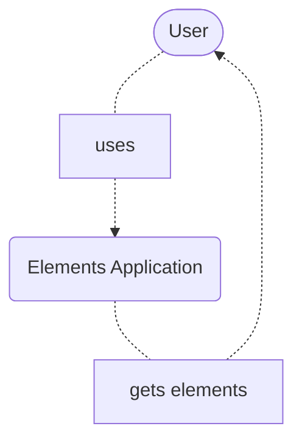
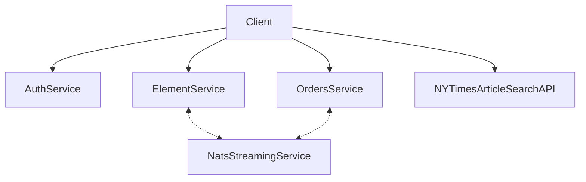
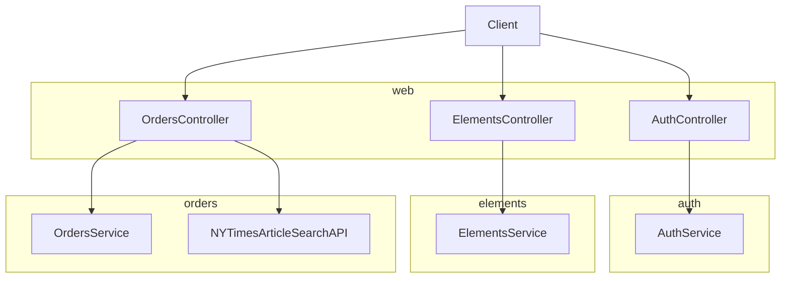
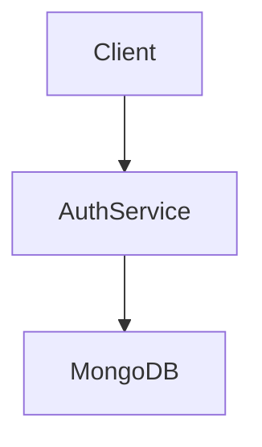
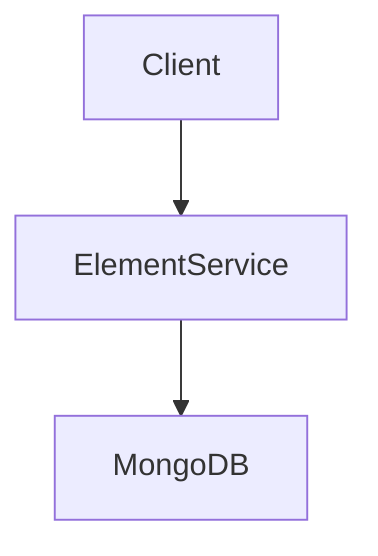
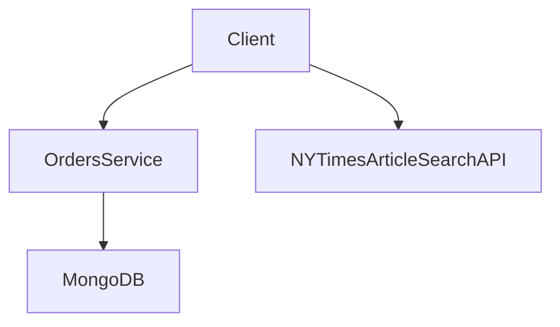

# NextJS Server Side Web Application +  ReactJS Microservices
This project is a proof of concept containing a SSR web client and a couple of back-end microservices all written using the ReactJS and TypeScript. This project is mainly used for learning purposes only.

## Functionalities
A <b>user</b> can:
 Functionality      | REST API | 
| :---        |    :----:   | 
| create an element that she/he wants to sell      | POST /api/elements/new     | 
| see a list of all available elements   | GET /api/elements | 
| select an element to view more details | GET /api/element/:id |
| create an order to order an element | POST /api/orders |
| see a list of orders | GET /api/orders |

## Tools, technologies & frameworks
- docker
- kubernetes
- skaffold
- ingress-nginx
- NATS Streaming Server
- Next JS
- React
- Typescript
- NYTimesArticleSearchAPI
---
# Diagrams

Below are presented some c4 diagrams.

## Context diagram



# Container diagram (of Elements application)



# Component diagram (of Client)



# Component diagram (of AuthService)



# Component diagram (of ElementService)



# Component diagram (of OrdersService)



# Code diagram for elements

```mermaid
classDiagram

    Publisher<|--ElementCreatedPublisher
    Publisher<|--ElementUpdatedPublisher
    Publisher : subject
    Publisher : client
    Publisher : publish()

    ElementCreatedPublisher : subject
    ElementCreatedPublisher : client
    ElementCreatedPublisher : publish()

    ElementUpdatedPublisher : subject
    ElementUpdatedPublisher : client
    ElementUpdatedPublisher : publish()

    Listener<|--OrderCreatedListener
    Listener : subject
    Listener : queueGroupName
    Listener : onMessage()
    Listener : client
    Listener : ackWait
    Listener : listen()

    OrderCreatedListener : subject
    OrderCreatedListener : queueGroupName
    OrderCreatedListener : onMessage()
    OrderCreatedListener : client
    OrderCreatedListener : ackWait
    OrderCreatedListener : listen()

    class Element 
    {
        id
        title
        price
        version
        userId
        orderId
    }

    Element <-- Index
    Element <-- New
    Element <-- Show
    Element <-- Update

    ElementCreatedPublisher <-- New
    ElementUpdatedPublisher <-- Update    

```

## SOA patterns used to develop this app
- Microservice Arhitecture
- Database per Service: mongo-db docker image
- Server-side discovery: ingress-nginx
- Messaging: NATS Streaming Server
- Access Token: JWT